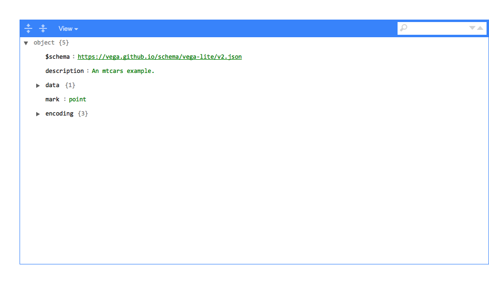

<!-- README.md is generated from README.Rmd. Please edit that file -->

[](https://www.tidyverse.org/lifecycle/#maturing)
[](https://travis-ci.org/vegawidget/vegawidget)
[](https://cran.r-project.org/package=vegawidget)

# vegawidget

The goal of vegawidget is to render Vega-Lite and Vega specifications
into htmlwidgets. Its ambition is to be a low-level interface to the
Vega(-Lite) API, such that other packages can build upon it to offer
higher-level functions to compose Vega(-Lite) specifications. This is
the key difference with the
[vegalite](https://github.com/hrbrmstr/vegalite) package; this package
provides a but minimal interface to Vega-Lite.

## Installation

You can install vegawidget from GitHub with:

``` r
# install.packages("devtools")
devtools::install_github("vegawidget/vegawidget")
```

An [interactive
tutorial](https://ijlyttle.shinyapps.io/vegawidget-overview) is
available at shinyapps.io.

## Introduction

Vega(-Lite) specifications are just text, formatted as JSON. However, in
R, we can use lists to build such specifications:

``` r
library("vegawidget")

spec_mtcars <-
  list(
    `$schema` = vega_schema(), # specifies Vega-Lite
    description = "An mtcars example.",
    data = list(values = mtcars),
    mark = "point",
    encoding = list(
      x = list(field = "wt", type = "quantitative"),
      y = list(field = "mpg", type = "quantitative"),
      color = list(field = "cyl", type = "nominal")
    )
  ) %>% 
  as_vegaspec()
```

The `as_vegaspec()` function is used to turn the list into a *vegaspec*;
a good many of the functions in this package are built to support, and
render, vegaspecs:

``` r
spec_mtcars
```

<!-- -->

If you are reading this document on the GitHub code site, it is further
rendered into a PNG. In the background, the vegaspec print-method
converts the vegaspec to JSON, using `vw_as_json()`, then renders it as
an htmlwidget using `vegawidget()`.

If you wish to examine a vegaspec, you may use the `vw_examine()`
function, which is a thin wrapper around the `jsonedit()` function from
the **listviewer** package.

``` r
vw_examine(spec_mtcars)
```

<!-- -->

If you wish to deploy a vegaspec to be rendered on
[bl.ocks.org](https://bl.ocks.org/), you can do that, provided you have
a GitHub account.

``` r
vw_create_block(spec_mtcars)
```

Similarly, if a block has a `.json` file with a JSON specification, you
can retrieve and put into a
vegaspec:

``` r
spec_new <- vw_retrieve_block("ijlyttle/06a512525fbe7a96e1a2028e1871b61c")
```

## Integration with other packages

This package provides functions to render Vega(-Lite) specifications;
although it provides some helpers, it dos not provide higher-level
functions to build specifications. Rather, this is left to other
packages. Even though you can use its functions directly, you are
invited to import and re-export them for use in *your* package.

Accordingly, this package offers a templating function,
`use_vegawidget()`, to help you integrate vegawidget functions into your
package. This function is used to [import and re-export vegawidget
functions](https://github.com/vegawidget/altair/blob/master/R/utils-vegawidget.R)
for the [altair](https://vegawidget.github.io/altair) package.

## Acknowlegdements

  - [Alicia Schep](https://github.com/AliciaSchep) has been instrumental
    in guiding the evolution of the API.
  - [Bob Rudis](https://github.com/hrbrmstr) and the
    [vegalite](https://github.com/hrbrmstr/vegalite) package provided a
    lot of the inspiration for this work, providing a high-level
    interface to Vega-Lite.
  - The [Altair](https://altair-viz.github.io) developers, for further
    popularizing the notion of using a programming language (Python) to
    create and render Vega-Lite specifications.  
  - The [Vega-Lite](https://vega.github.io/vega-lite/) developers, for
    providing a foundation upon which the rest of this is built.

## Contributing

Contributions are welcome, please see this [guide](CONTRIBUTING.md).
Please note that this project is released with a [Contributor Code of
Conduct](CODE_OF_CONDUCT.md). By participating in this project you agree
to abide by its terms.
