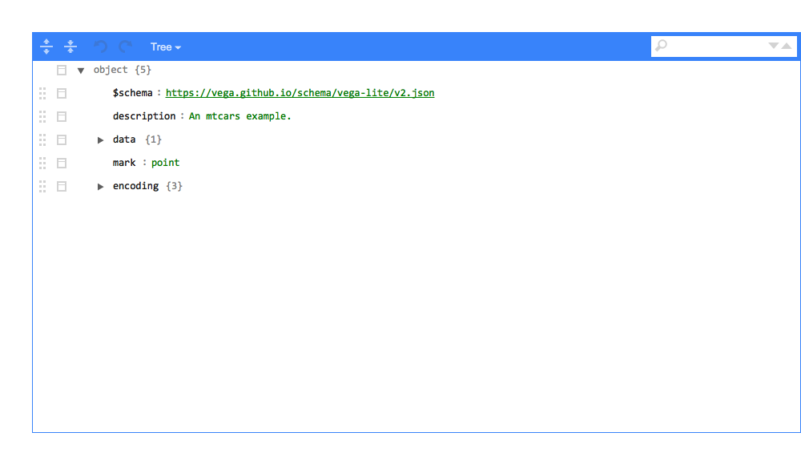

<!-- README.md is generated from README.Rmd. Please edit that file -->

[](https://www.tidyverse.org/lifecycle/#experimental)
[](https://travis-ci.org/vegawidget/vegawidget)
[](https://cran.r-project.org/package=vegawidget)

# vegawidget

The goal of vegawidget is to render Vega-Lite and Vega specifications
into htmlwidgets. For now, this document serves as a manifesto for what
we might hope for the package.

``` r
library("vegawidget")

spec_mtcars <-
  list(
    `$schema` = "https://vega.github.io/schema/vega-lite/v2.json",
    description = "An mtcars example.",
    data = list(values = mtcars),
    mark = "point",
    encoding = list(
      x = list(field = "wt", type = "quantitative"),
      y = list(field = "mpg", type = "quantitative"),
      color = list(field = "cyl", type = "nominal")
    )
  )  

vegawidget(spec_mtcars)
```

<!-- -->

``` r
examine(spec_mtcars)
```

<!-- -->

## Specifications

Vega and Vega-Lite specifications are just text, formatted as JSON. It
is this package’s responsibiity to render such specifications; allowing
you to develop packages that *build* specifications. To take advantage
of this package, it will be easiest if your specification built by your
package is an S3 class based on lists or JSON.

For example, consider the **altair** package, which uses **reticulate**
to work with the **Altair** Python package to build Vega-Lite
specifications.

``` r
class(altair::alt$Chart())
```

    [1] "altair.vegalite.v2.api.Chart"                          
    [2] "altair.vegalite.v2.api.TopLevelMixin"                  
    [3] "altair.vegalite.v2.schema.mixins.ConfigMethodMixin"    
    [4] "altair.vegalite.v2.api.EncodingMixin"                  
    [5] "altair.vegalite.v2.schema.mixins.MarkMethodMixin"      
    [6] "altair.vegalite.v2.schema.core.TopLevelFacetedUnitSpec"
    [7] "altair.vegalite.v2.schema.core.VegaLiteSchema"         
    [8] "altair.utils.schemapi.SchemaBase"                      
    [9] "python.builtin.object" 

The

The central function here will be `vegawidget()`, to render an
htmlwidget from a Vega/Vega-Lite specification. Supporting functions
will include:

  - `examine()`
  - `create_block()`

Behind the scenes, the workhorse function is `as_vegaspec()`. To
implement the `vegawidget()` functions for “your” S3 object that
implements a Vega or Vega-Lite specification, you may have to implement
a method for your class for the `as_vegaspec()` generic, as well as
methods for `print()` and `knit_print()`.

The vegawidget

  - `list`
  - `character`
  - **jsonlite** `json` object

Note about webshot and phantomJS.

For a package such as **altair**, it becomes that pacakge’s
responsibility to provide methods for its objects.

In the future, challenges will include:

  - when knitting to a non-interactive format, e.g. `github_document`
    getting the “right” thing to happen
  - offering **crosstalk** compatibility
  - offering reactive **shiny** behavior, like **ggvis** provides for
    its Vega specifications

## Installation

You can install vegawidget from github with:

``` r
# install.packages("devtools")
devtools::install_github("vegawidget/vegawidget")
```
